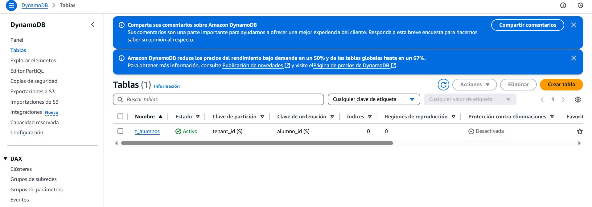
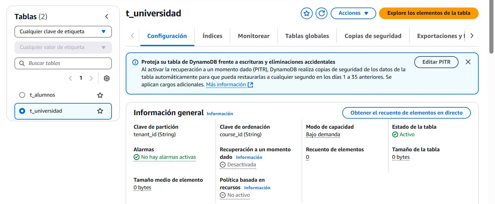
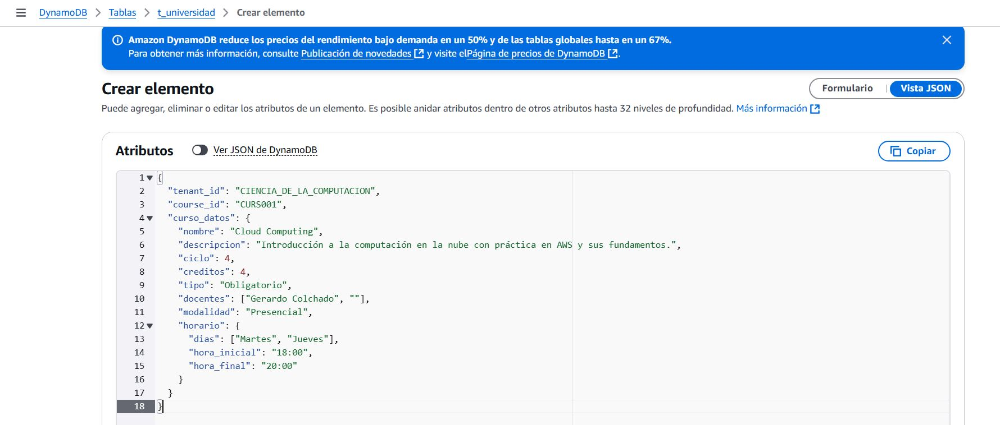
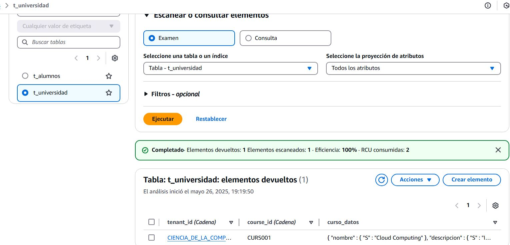
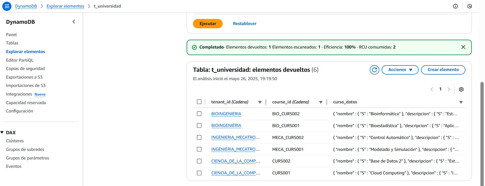
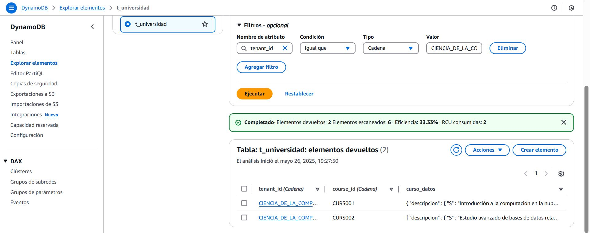

# multy-tenancy


## Ejercicio:

Diseñe e implemente en DynamoDB una tabla Multi-tenancy de su preferencia e inserte 6 registros (2 por cada tenant_id).

## 1. ¿Qué se hará?
Se creará la tabla Multi-Tenant **t_universidad** en DynamoDB, aplicando el Patrón 1 (Single, Shared Database Schema)



A continuación, se muestra la tabla ya creada:



## 2. Insertar el primer dato con el siguiente formato:
```
{
  "tenant_id": "CIENCIA_DE_LA_COMPUTACION",
  "course_id": "CURS001",
  "curso_datos": {
    "nombre": "Cloud Computing",
    "descripcion": "Introducción a la computación en la nube con práctica en AWS y sus fundamentos.",
    "ciclo": 4,
    "creditos": 4,
    "tipo": "Obligatorio",
    "docentes": ["Gerardo Colchado", "Oscar Mejia"],
    "modalidad": "Presencial",
    "horario": {
      "dias": ["Lunes", "Jueves", "Sabado"],
      "hora_inicial": "7:00",
      "hora_final": "9:00"
    }
  }
}
```

### 3. Formato de los datos insertados:

En este caso cada elemento de la tabla tiene un elemento JSON el cual sus elementos mas relevantes son estos:
* **tenant_id:** clave de partición (Partition Key), esta identificará a las carreras de la universidad. Son 3: Ciencia de la Computación, Ingeniería Mecatrónica y Bioingeniería.
* **course_id:** clave de ordenamiento (Sort Key), permite identificar cada curso de forma única. 

Los otros atributos son adicionales que muestran información del curso seleccionado.

## 4. Crear elemento:

Ingresamos a la opción "Crear Elemento" en la consola de DynamoDB, y una vez allí, llenamos los campos con los datos correspondientes.

A continuación se muestra la inserción del primer dato:





Después, se procede a insertar los demás cursos correspondientes a cada carrera:



## 5. Testing:

Finalmente, realizamos una consulta usando la clave de partición (tenant_id) y clave de ordenamiento (course_id) para verificar que la estructura y los datos sean correctos.


